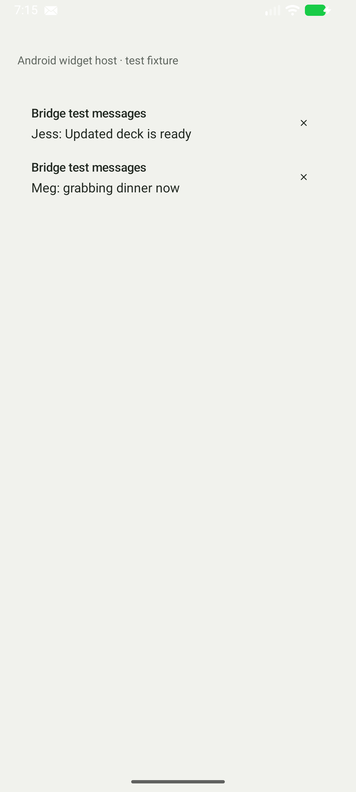

# Kvaesitso Bridge

A small Android companion that puts a quiet, transparent notification feed on your home screen. Tap text to open a notification; tap its small × to dismiss it when Android allows. Full, App only and Hidden rules control each app's content.

<!-- Screenshot placeholder: replace with a screenshot of the widget on your own wallpaper. -->


Synthetic test notifications are shown here. Screenshots and local verification details are in [docs/VERIFICATION.md](docs/VERIFICATION.md).

## Stock Kvaesitso stays stock

Bridge is a standard Android widget, not a launcher or Kvaesitso fork. It works with other widget hosts and contains no Kvaesitso code or SDK dependency. Kvaesitso can update independently. The [upstream idea](docs/KVAESITSO_UPSTREAM_IDEA.md) describes a future optional way to place secondary text under favorites.

## Install and receive updates

[Add to Obtainium](https://apps.obtainium.imranr.dev/redirect?r=obtainium://app/%7B%22id%22%3A%22com.adamdelisi.kvaesitsobridge%22%2C%22url%22%3A%22https%3A%2F%2Fgithub.com%2Fmassiveadam%2Fkvaesitso-bridge%22%2C%22author%22%3A%22massiveadam%22%2C%22name%22%3A%22Kvaesitso%20Bridge%22%7D) or paste `https://github.com/massiveadam/kvaesitso-bridge` into Obtainium's Add app screen. Install the signed APK from [GitHub Releases](https://github.com/massiveadam/kvaesitso-bridge/releases/latest). Obtainium follows future releases. See [release and signing instructions](docs/RELEASING.md).

If you already installed the debug APK, uninstall it once before installing the signed release. Subsequent release updates preserve settings.

## Build and install

Requires a full JDK 21, Android SDK platform 37.0 and build tools 36.0.0. Install these through Android Studio's SDK manager. AGP 9.4.1, Gradle 9.8.0, Kotlin 2.4.10 and Glance 1.2.0 are pinned. AGP supplies built-in Kotlin support.

Set `ANDROID_HOME` to your SDK, or create an ignored `local.properties` with `sdk.dir=/absolute/path/to/sdk`.

```sh
./gradlew build testDebugUnitTest lint assembleDebug
adb install -r app/build/outputs/apk/debug/app-debug.apk
```

Minimum Android 12. On a phone, copy the APK and allow installation from the file manager. Debug APKs are installable; release APKs are unsigned. For years of updates, sign releases with one stable private key and keep it outside this repository. A CI debug key changes between clean runners, so CI debug APKs are unsuitable as a permanent update channel.

## Setup

1. Open Bridge. Tap **Enable notification access**, select Bridge and grant Notification Access. Android may require **App info → menu → Allow restricted settings** for sideloaded apps before granting access.
2. Return to Bridge and confirm access is enabled. The live preview shows eligible notifications.
3. In Kvaesitso, scroll to the end of the widgets list, choose **Edit widgets → Add widget**, then **Kvaesitso Bridge**. Resize vertically. Other launchers expose their normal widget picker. Bridge also offers an add button when the launcher supports widget pinning.
4. Use **Apps** to choose Full, App only or Hidden after an app sends a notification. **Include background status** overrides noise filtering for that app. Ongoing items also require the global toggle in **Notifications**.
5. Choose Light or Dark text in **Appearance** if automatic day/night text has poor wallpaper contrast.

The default feed suppresses media controls, foreground services, system/progress status and silent background noise. Silent conversations, messages and reminders remain eligible. Group summaries give way to their visible children. Multiple messages from one app retain separate actions. Null content becomes an app-name row.

## Privacy and reliability

No INTERNET permission, analytics, ads, cloud service or notification history. Content and intents remain in memory. Only preferences and observed app identities persist in local DataStore. Android backup is disabled. Hidden apps and content privacy apply to both the widget and the app preview.

Android's listener provides event-driven updates and an authoritative active snapshot after reconnects. The settings app need not stay open. Reboot, app replacement and widget restoration use Android's normal lifecycle. No foreground service or polling is used. After a user force-stop, reopen Bridge once. Notifications in work/private profiles, OTPs and other sensitive content may be withheld or redacted by Android.

## Architecture

`AndroidNotificationMapper → NotificationRepository → NotificationFilter → Flow → Compose / Glance`.

The listener owns Android state, the filter owns feed policy, and settings own only preferences. Widget actions resolve current notification keys at the Android boundary. The small `BridgeAction` type leaves room for later commands. See [architecture and API review](docs/ARCHITECTURE.md).

## Widget limitations

- Android widgets support taps and callback actions, not reliable custom swipe-to-dismiss gestures.
- A 14dp × sits inside a 48dp touch target. Non-clearable notifications have no dismiss control.
- Height and font scaling limit rows; the default maximum is five. Very short widgets show an app-only row.
- System light/dark mode does not reveal wallpaper brightness. Manual text color is available.
- Launchers retain the last rendered widget image. Locked-content redaction and permission revocation refresh asynchronously; they cannot guarantee immediate erasure of a cached image. Use global App only privacy if content must never reach the launcher.
- After process recreation, the feed can briefly show a connecting state while Android rebinds. There is no disk cache of notification text.
- Source apps can cancel their PendingIntents or restrict what they open. Bridge falls back to the app's launcher entry when possible.

## Verification and CI

Useful local tests cover filtering, privacy, ordering, grouping, limits, reconnect snapshots and layout budgets. Lint treats warnings as errors. See [verification instructions](.agents/skills/verify-kvaesitso-bridge/SKILL.md) and [recorded results](docs/VERIFICATION.md).

GitHub Actions builds, tests and lints every push and pull request. Tagged `v*` builds sign the verified APK and publish a GitHub Release for Obtainium. Signing material is held in encrypted Actions secrets, outside Git. Pull request checks do not use signing secrets.

## Roadmap

- Validate daily use and launcher layouts on a Pixel 10 Pro.
- Add a small set of Android commands and dynamic shortcuts, with permission checks per command.
- Consider an isolated public secondary-text provider only if Kvaesitso adds a documented API.

Apache 2.0 is included and recommended for straightforward reuse. Bridge is independent of Kvaesitso and is not affiliated with its maintainers.
