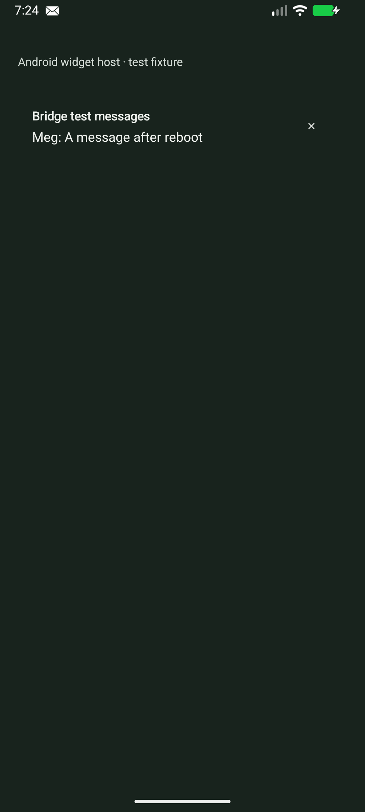
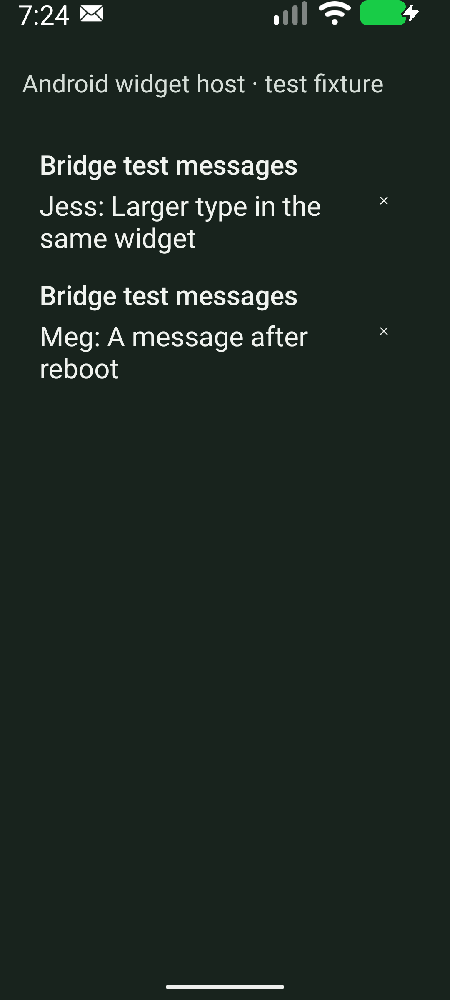
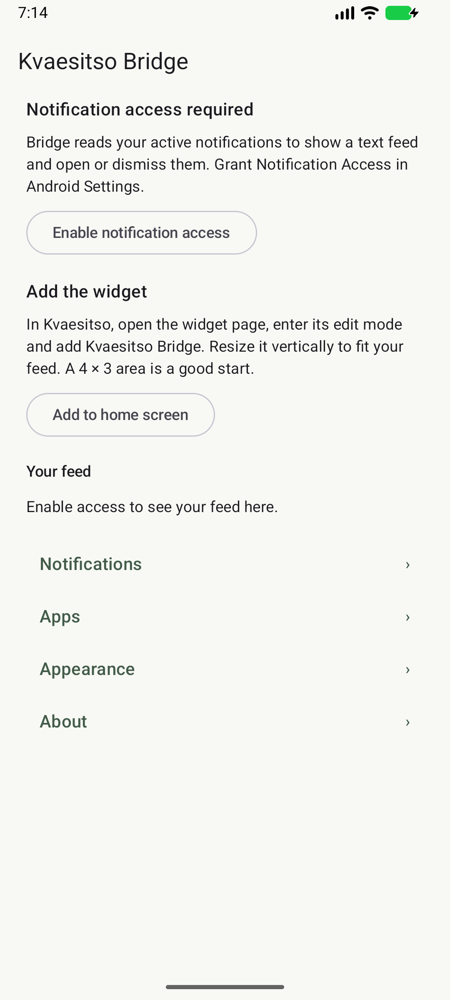
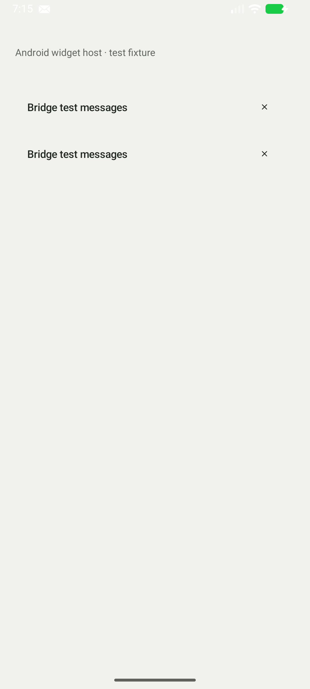

# Verification

Verified locally on 2026-10-04 with a full Temurin JDK 21, SDK platform 37.0, build tools 36.0.0, AGP 9.4.1 and Gradle 9.8.0.

```sh
./gradlew build testDebugUnitTest lint assembleDebug --max-workers=2 --console=plain
```

Result: `BUILD SUCCESSFUL`. 26 unit tests passed. Android lint reports `No issues found`, with warnings treated as errors. Both the debug APK and minified unsigned release APK were built. Debug native libraries also passed a 16 KB zip alignment check.

- Installable debug APK: `app/build/outputs/apk/debug/app-debug.apk`
- Unsigned release APK: `app/build/outputs/apk/release/app-release-unsigned.apk`
- Tests: `app/build/reports/tests/testDebugUnitTest/index.html`
- Lint: `app/build/reports/lint-results-debug.html`

The build emits a Gradle configuration deprecation from AGP's use of `Configuration.setVisible`. The pinned toolchain still builds successfully. It is unrelated to app code or Android lint.

## Real Android checks

Installed and launched the app on a disposable Android 17 emulator, API 37. The detected physical phone was unauthorized for ADB and was not used. The fixture posts real notifications through NotificationManager and renders the product through an ordinary AppWidgetHost. No test hooks alter the product repository.

The recorded driver checkpoints cover:

| Behavior | Result |
| --- | --- |
| Missing access in app and widget; Android settings button | Passed |
| Access granted and zero notifications | Passed |
| One notification and multiple independent same-app notifications | Passed |
| Notification contentIntent opens the source activity | Passed |
| Dismiss callback cancels the Android notification | Passed |
| Updating an existing notification replaces its text | Passed |
| App only removes content; Hidden offers settings guidance | Passed |
| Ongoing noise is suppressed by default | Passed |
| Ongoing app override and global gate; non-clearable row lacks × | Passed |
| Group summary disappears in favor of eligible children | Passed |
| Revocation removes content; reconnect rebuilds active state | Passed |
| Null content remains an app-name row | Passed |
| Missing contentIntent falls back to the source app | Passed |
| Notifications from two different apps | Passed |
| Background process killed; old and new active notifications reappear | Passed |
| APK replacement while notification state is active | Passed |
| Device reboot drops stale content; new notifications work afterward | Passed |
| Automatic dark text configuration and 180% font scale | Passed and visually inspected |
| Source app uninstalled; settings list and persisted rules cleared | Passed |

27 unique checkpoints were captured by the basic and extended driver passes on the final debug APK. Two additional uninstall checkpoints verified the source before removal and the cleared settings afterward. Preferences, Glance layout files and WorkManager databases were inspected for the synthetic notification phrases; none were present. The merged app manifest contains no network permission or foreground service.

The minified release APK was signed with a disposable local debug key and installed separately. Four additional release checkpoints positively verified settings startup, real widget rendering, opening the notification's source activity and the reflective dismiss callback. The crash log was empty. This caught and fixed a startup failure from Glance's obsolete transitive WorkManager/Room versions before completion; the dependency pin is explained in the architecture document. The test-signed APK and key are not repository artifacts.

One repeat of the reboot check encountered an unrelated Pixel Launcher ANR dialog over the fixture. Android's active notification and Bridge listener were present; after closing that dialog the widget showed the expected message. The driver records this specific system dialog and closes it before continuing. It never dismisses a Bridge or fixture ANR.

## Screenshots

These show synthetic messages in the test host, not screenshots of Kvaesitso or a Pixel 10 Pro.

  

 

## Repeat the checks

Follow the [project verification skill](../.agents/skills/verify-kvaesitso-bridge/SKILL.md). The [driver](../tools/verify_device.py) requires an explicitly selected disposable emulator, clears test state, and writes PNG screenshots, UI XML trees and `results.json` to `.verification/device`. `--extended-only` also changes system appearance, kills the app process, replaces the APK and reboots the emulator. The optional fixture module is excluded from the default build and never ships in the Bridge APK.

## Coverage limits

A stock Kvaesitso installation and physical Pixel 10 Pro were not available for hands-on testing. Widget ID remapping through an Android backup restoration was not driven; it uses the stock Glance receiver's lifecycle. Lock redaction is unit-tested and reacts to system screen/lock events, but this run did not configure a secure lock screen. Launcher-cached RemoteViews can retain prior content until an asynchronous update, as documented in the README. GitHub Actions is configured but has not run on GitHub from this local workspace.
